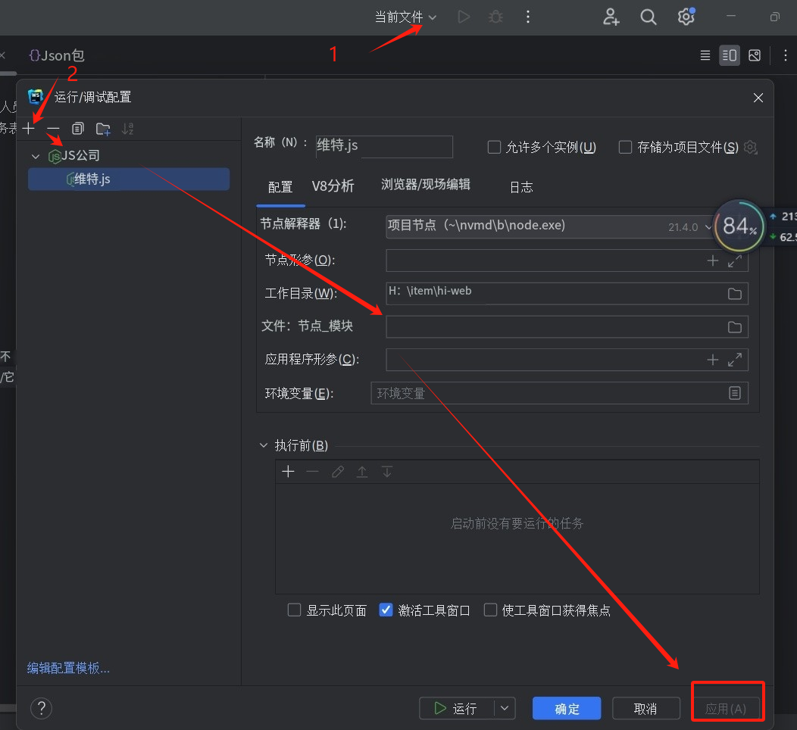

# Emm...

该项目是Emm的Web管理界面，主要显示数据库ER图，为编码人员提供了解公司业务表结构的便捷方式，
帮助他们快速熟悉关键业务表，提高开发效率。

## 技术栈:

- Vite5
- React 18
- Jotai
- NextUi 2.2.9
- Tailwind CSS 3
- Sweetalert2

## 问题:
 1、项目怎么运行？    
- 首先编辑启动，添加Node.js，然后在【JavaScript 文件(E):】  
  填上node_modules\vite\bin\vite.js
- 

## 推荐工具
- Node.js版本控制，可以快速下载对应的Node.js【Release Notes for】 https://github.com/1111mp/nvm-desktop

